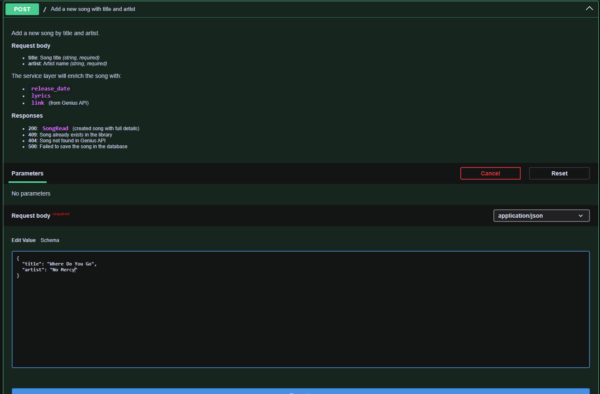
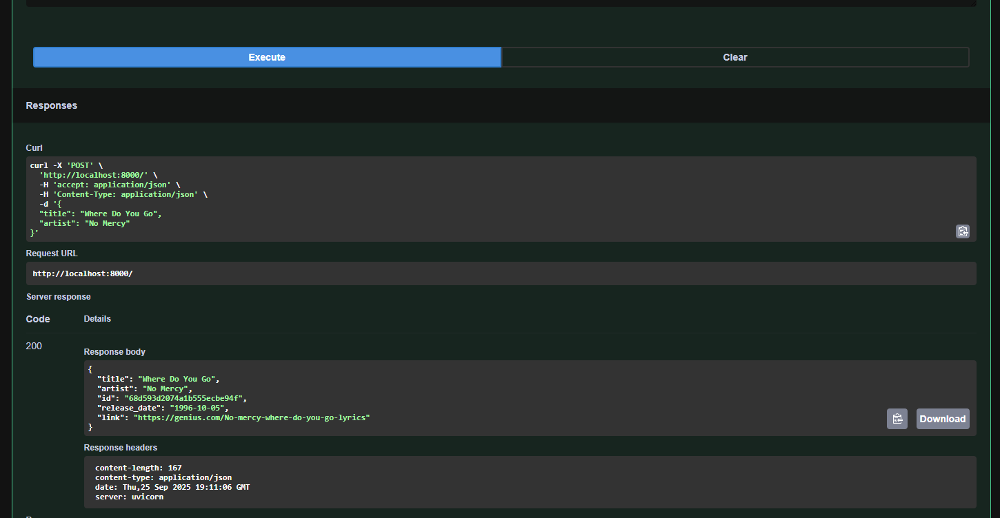
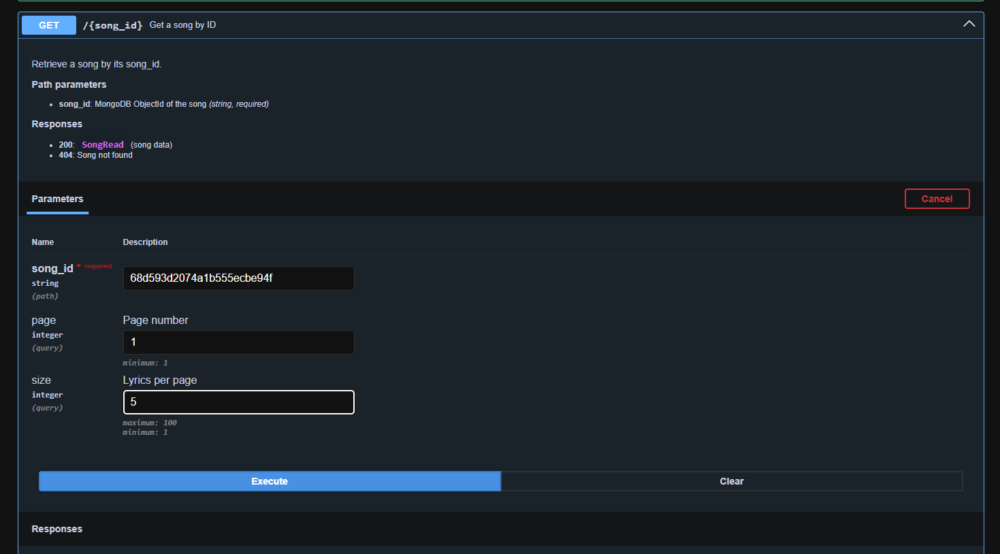
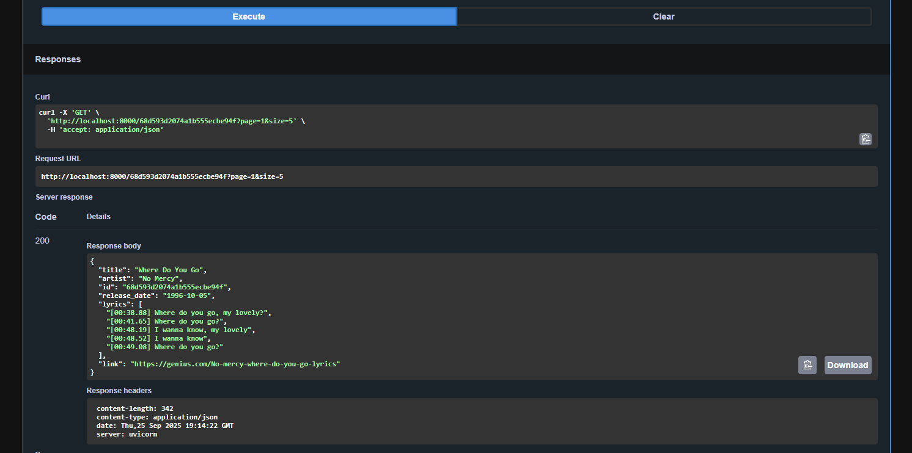
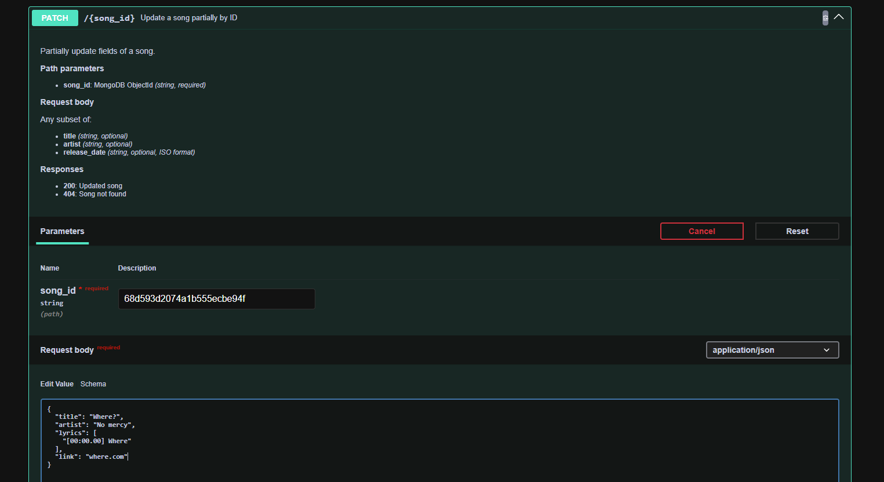
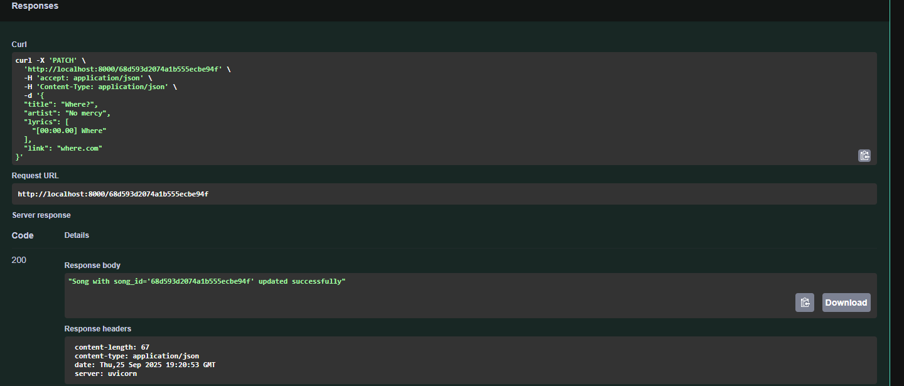
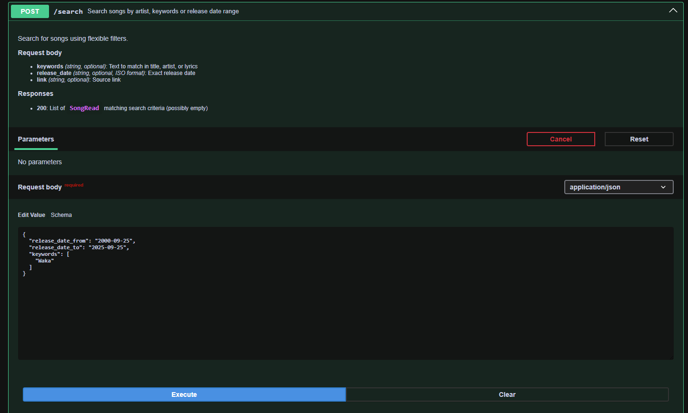
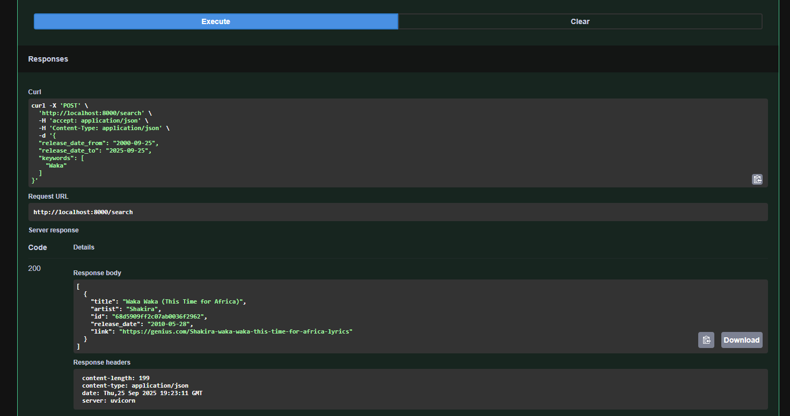

**SongAPI 🎶**

A FastAPI-based music library service running in Docker with MongoDB.
The API allows you to manage and query songs, and comes with full auto-generated API docs.

**🚀 Features:**

- FastAPI with async support

- MongoDB persistence (via motor/beanie)

- Access to all songs from Genius API

- Docker Compose for easy setup

- Interactive API documentation


**📦 Requirements:**

- Docker

- Docker Compose

**🛠️ Installation & Running**

1) Clone the repository:

```gitbash
git clone https://github.com/yourusername/songapi.git
cd songapi
```

2) Build and start the services:
```docker
docker-compose up --build
```

FastAPI will be available at:

http://localhost:8000

**📖 Usage**

Example requests:

<center>Request</center>



<center>Response</center>



<center>Request</center>



<center>Response</center>



<center>Request</center>



<center>Response</center>



<center>Request</center>



<center>Response</center>



**📝Documentation**

Swagger UI: http://localhost:8000/docs

ReDoc: http://localhost:8000/redoc

**🗂️ Project Structure**

app/

├── controllers/     # API routes (controllers)

├── services/        # Business logic

├── repositories/    # Data access (MongoDB)

├── core/            # Core settings, config

├── db/              # Database initialization

└── main.py          # FastAPI entrypoint